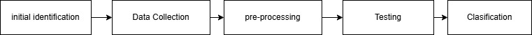
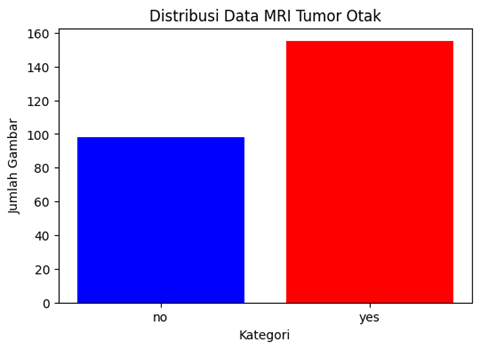
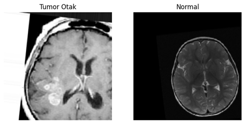
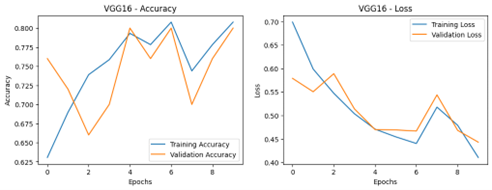
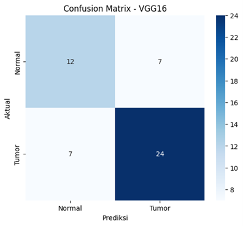
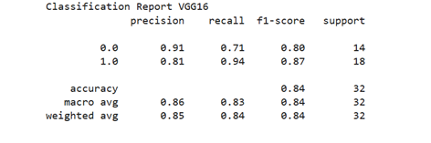

# Klasifikasi Tumor Otak Menggunakan Convolutional Neural Network Berbasis Model VGG16  

Disusun Oleh :  
Gilang Arbiansyah 2206074  
Virzza Rahmaliyadi 2206103  

# BAB I PENDAHULUAN  
Tumor adalah suatu kondisi yang ditandai dengan pertumbuhan sel abnormal yang membentuk massa atau neoplasma, yang sering kali menyerupai pembengkakan (Resnet & Saputra, 1907). Tumor dapat berkembang di berbagai organ tubuh manusia, termasuk otak (Candra et al., 2024). Berdasarkan data epidemiologi dari tinjauan sistematis, insidensi tumor otak di seluruh dunia tercatat sebesar 10,82 per 100.000 penduduk per tahun, dengan rentang antara 0,01 hingga 25,95 per 100.000 penduduk per tahun (Pratama et al., 2024). Tumor otak dapat dibedakan menjadi dua jenis, yaitu tumor primer yang berkembang langsung di otak dan tumor sekunder yang merupakan hasil metastasis dari organ lain (Otak et al., n.d.). Glioma merupakan jenis tumor otak primer yang paling sering ditemukan, di mana sekitar 78% dari total kasus tumor otak ganas termasuk dalam kategori ini (Septipalan et al., 2024). Selain itu, data dari Central Brain Tumor Registry of the United States (CBTRUS) menunjukkan bahwa meningioma adalah tumor otak yang paling sering terdiagnosis secara histologis dengan angka 36,8%, diikuti oleh tumor pituitari sebesar 16,2% (Candra et al., 2024).   

Untuk mendeteksi keberadaan tumor otak secara akurat, pasien umumnya disarankan menjalani pemeriksaan pencitraan medis seperti CT Scan atau MRI (Pratama et al., 2024). Dari hasil pencitraan medis tersebut, tumor dapat diklasifikasikan berdasarkan lokasi dan jenisnya. Namun, klasifikasi secara manual oleh tenaga medis sering kali membutuhkan waktu yang lama dan memiliki potensi kesalahan. Oleh karena itu, diperlukan suatu metode berbasis kecerdasan buatan yang dapat membantu mengklasifikasikan tumor otak dengan lebih efisien dan akurat. Salah satu metode yang saat ini banyak digunakan dalam analisis pencitraan medis adalah Convolutional Neural Network (CNN) (Otak et al., n.d.).   

CNN adalah teknik dalam deep learning yang sangat efektif dalam mengenali pola pada citra, termasuk pencitraan medis. Dengan menggunakan CNN, proses klasifikasi tumor otak dapat dilakukan secara otomatis berdasarkan karakteristik visual dari citra MRI. Salah satu model arsitektur CNN yang telah terbukti efektif dalam tugas klasifikasi citra adalah VGG-16. Model ini dikembangkan oleh K. Simonyan dan A. Zisserman dari Universitas Oxford dan berhasil mencapai kinerja yang sangat baik dalam pengenalan gambar pada dataset skala besar (Resnet & Saputra, 1907).   

Dalam penelitian ini, metode CNN dengan model VGG-16 diterapkan untuk mengklasifikasikan jenis tumor otak berdasarkan citra MRI. Tumor otak akan dikategorikan ke dalam empat kelas, yaitu Glioma Tumor, Meningioma Tumor, No Tumor, dan Pituitary Tumor. Tujuan dari penelitian ini adalah untuk mengembangkan sistem klasifikasi berbasis deep learning yang dapat membantu tenaga medis dalam mendiagnosis tumor otak dengan lebih cepat dan akurat. Dengan adanya sistem ini, diharapkan dapat meningkatkan efisiensi diagnosis serta membantu dalam upaya deteksi dini tumor otak, sehingga penanganan dapat dilakukan lebih tepat dan efektif(Septipalan et al., 2024). 

# BAB II METODE PENELITIAN  
  
1.	Persiapan Data  
Langkah pertama dalam pembuatan model ini adalah menyiapkan data yang akan digunakan untuk melatih dan menguji model. Dataset yang digunakan terdiri dari gambar MRI otak yang dibagi menjadi dua kategori, yaitu Tumor dan Normal. Data gambar ini kemudian diubah menjadi format yang dapat diproses oleh model menggunakan ImageDataGenerator. 

2.  Preprocessing dan Augmentasi Data  
Sebelum digunakan untuk pelatihan, gambar-gambar diubah ukurannya menjadi 224x224 piksel karena ukuran tersebut cocok dengan arsitektur model VGG16 yang akan digunakan. Selain itu, gambar juga diproses agar nilai pikselnya berada dalam rentang [0, 1] dengan melakukan normalisasi. Augmentasi gambar juga dilakukan untuk menambah variasi data dan mencegah overfitting, misalnya dengan rotasi gambar, pergeseran, dan pembalikan horizontal. 

3.  Arsitektur Model  
Dalam model ini, digunakan arsitektur VGG16 yang sudah dilatih sebelumnya pada dataset ImageNet. Kami memanfaatkan transfer learning dengan menggunakan model VGG16 tanpa lapisan klasifikasinya, karena lapisan tersebut tidak dibutuhkan untuk dataset kita. Kemudian, lapisan klasifikasi baru ditambahkan di atasnya, terdiri dari lapisan dense dengan fungsi aktivasi ReLU dan sigmoid untuk output biner (Tumor atau Normal). 

4.	Pelatihan Model  
Setelah arsitektur model siap, langkah berikutnya adalah pelatihan. Proses pelatihan dilakukan selama beberapa epoch, di mana model belajar untuk memprediksi kategori gambar berdasarkan data pelatihan. Kami menggunakan optimizer Adam dengan learning rate yang sangat kecil agar proses pelatihan berjalan lebih stabil. Setiap epoch, hasil model dievaluasi menggunakan data validasi untuk memeriksa seberapa baik model bekerja pada data yang tidak terlihat sebelumnya.  

5.	Evaluasi Model 
Setelah pelatihan selesai, evaluasi dilakukan pada model untuk mengukur seberapa akurat model dalam mengklasifikasikan gambar. Pengukuran dilakukan menggunakan akurasi, yaitu persentase gambar yang diklasifikasikan dengan benar. Selain itu, confusion matrix juga digunakan untuk menunjukkan bagaimana model mengklasifikasikan gambar pada setiap kategori.  

# BAB III HASIL DAN PEMBAHASAN  
## 3.1 Distribusi Data MRI dalam Dataset  
  
Sebelum melakukan pelatihan model, sangat penting untuk memahami distribusi data dalam dataset. Pada dataset ini, citra MRI otak dibagi menjadi dua kelas utama: Tumor dan Normal. Dengan melihat jumlah gambar pada setiap kelas, kita dapat memastikan keseimbangan data, yang penting untuk menghindari bias model. Grafik di bawah ini menggambarkan jumlah citra pada masing-masing kelas. 
Contoh grafik distribusi kelas:  
1. Kelas Tumor: Menampilkan jumlah citra MRI yang mengandung tumor. 
2. Kelas Normal: Menampilkan jumlah citra MRI yang menunjukkan kondisi otak normal. 
Jika dataset tidak seimbang, teknik seperti oversampling atau augmentasi data dapat digunakan untuk menyeimbangkan distribusi kelas.  

## 3.2 Visualisasi Contoh Citra MRI  
Setelah dataset dimuat menggunakan ImageDataGenerator dari Keras, beberapa contoh citra MRI dari setiap kelas dipilih untuk divisualisasikan. Visualisasi ini penting untuk memahami karakteristik dari data yang digunakan. Berikut adalah beberapa contoh citra:  
1.	Kelas Tumor: Citra MRI yang menunjukkan adanya anomali atau pertumbuhan yang           mengindikasikan adanya tumor. 
2.	Kelas Normal: Citra MRI yang menunjukkan otak yang sehat tanpa tanda-tanda abnormalitas.
    Visualisasi ini membantu kita dalam memverifikasi kualitas data serta memeriksa apakah ada      masalah pada label data. 
  

## 3.3 Proses Training Model CNN (VGG16)  
Model VGG16 digunakan dalam eksperimen ini sebagai feature extractor. Arsitektur VGG16 terkenal karena kedalamannya (16 lapisan) dan kemampuannya dalam menangkap fitur visual penting dari citra. 
1.	Preprocessing dan Augmentasi Data: Sebelum memulai pelatihan, gambar MRI melalui proses augmentasi untuk meningkatkan keragaman dataset. Augmentasi ini mencakup rotasi, zoom, pemotongan acak, dan flipping horizontal untuk memperkenalkan variasi dalam data pelatihan, sehingga model dapat belajar lebih baik. 
2.	Penggunaan VGG16: VGG16 digunakan tanpa pelatihan ulang pada lapisan konvolusinya, tetapi lapisan fully connected yang ada pada bagian akhir model akan diubah untuk tugas klasifikasi biner (Tumor vs. Normal). 
3.	Proses Pelatihan: Model dilatih menggunakan optimizer Adam dan loss function binary cross-entropy selama 10 epoch. Setiap epoch dilalui dengan dataset pelatihan yang telah diaugmentasi. Selama proses ini, model belajar untuk membedakan ciri-ciri khas dari citra tumor dan normal. 
  

## 3.4 Evaluasi Model CNN (VGG16)  
a.	Confusion Matrix: Evaluasi Kinerja Model  
Confusion matrix memberikan gambaran tentang performa model dalam melakukan klasifikasi. Matrik ini menunjukkan jumlah prediksi yang benar dan salah, serta membedakan antara prediksi untuk kelas Tumor dan Normal. 
1.	True Positives (TP): Jumlah gambar yang benar-benar memiliki tumor dan diprediksi dengan benar sebagai tumor. 
2.	True Negatives (TN): Jumlah gambar yang normal dan diprediksi dengan benar sebagai normal. 
3.	False Positives (FP): Gambar yang normal tetapi diprediksi sebagai tumor (dikenal juga sebagai Type I error). 
4.	False Negatives (FN): Gambar yang mengandung tumor tetapi diprediksi sebagai normal (dikenal juga sebagai Type II error). 
  

## 3.5 Evaluasi dengan Clasification Report  
Classification report memberikan ringkasan metrik evaluasi yang lebih komprehensif. Ini mencakup:  
1.	Precision: Mengukur ketepatan prediksi model untuk kelas tertentu. Precision tinggi berarti sedikit prediksi salah untuk kelas tersebut. 
2.	Recall: Mengukur kemampuan model untuk menemukan semua instance dari kelas tertentu. Recall tinggi berarti model mampu mendeteksi banyak contoh positif meskipun ada kemungkinan banyak false positive. 
3.	F1-Score: Merupakan rata-rata harmonik dari precision dan recall, memberikan gambaran umum tentang performa model. 
4.	Accuracy: Persentase prediksi yang benar dibandingkan dengan total prediksi.
Classification report ini memberikan wawasan penting mengenai kualitas model dalam kedua kelas. 
  

# KESIMPULAN  
## Ringkasan Temuan  
Dalam eksperimen ini, model CNN dengan arsitektur VGG16 diterapkan untuk mengklasifikasikan gambar MRI tumor otak menjadi dua kategori: Tumor dan Normal. Berdasarkan hasil pelatihan dan evaluasi yang dilakukan, model VGG16 menunjukkan kinerja yang cukup baik dalam mendeteksi tumor otak pada dataset yang digunakan. Akurasi validasi mencapai nilai yang memadai, namun perlu diperhatikan bahwa hasil prediksi dan akurasi dapat dipengaruhi oleh berbagai faktor, seperti kualitas data dan teknik augmentasi gambar yang diterapkan.  
Sebagai tambahan, penggunaan teknik augmentasi seperti rotasi, pergeseran lebar dan tinggi, serta pembalikan horizontal terbukti efektif dalam memperkaya data pelatihan, yang pada gilirannya membantu meningkatkan kemampuan model untuk mengenali variasi gambar. Confusion Matrix yang dihasilkan dari evaluasi model menunjukkan bahwa model dapat membedakan dengan baik antara gambar tumor dan gambar normal, meskipun masih ada beberapa kesalahan klasifikasi yang perlu diperbaiki di masa mendatang.  

## Batasan Pekerjaan  
Beberapa keterbatasan yang dihadapi dalam penggunaan model CNN dengan arsitektur VGG16 untuk deteksi tumor otak antara lain adalah terbatasnya jumlah dan jenis gambar dalam dataset, yang dapat memengaruhi akurasi model. Meskipun augmentasi gambar membantu memperbaiki kinerja model, masih terdapat potensi untuk mengeksplorasi teknik augmentasi lain yang dapat lebih meningkatkan hasil prediksi. Selain itu, durasi pelatihan model VGG16 yang relatif panjang menjadi tantangan, di mana akurasi yang lebih tinggi mungkin tercapai dengan meningkatkan jumlah epoch atau menggunakan teknik lain untuk mempercepat proses pelatihan.  

## Rekomendasi Untuk Pekerjaan di Masa depan  
Untuk meningkatkan kualitas dan akurasi model klasifikasi tumor otak di masa depan, beberapa langkah yang dapat dipertimbangkan antara lain perluasan dataset dengan mengumpulkan lebih banyak data gambar MRI dari berbagai sumber, yang dapat membantu meningkatkan kemampuan model dalam melakukan generalisasi yang lebih baik. Selain itu, penerapan teknik augmentasi lainnya, seperti perputaran sudut yang lebih ekstrim, perubahan kontras, dan teknik pencahayaan, dapat memperkaya dataset dan meningkatkan kinerja model. Penggunaan transfer learning dengan arsitektur yang lebih canggih, seperti ResNet atau DenseNet, serta eksplorasi pretrained models yang lebih kuat, juga dapat meningkatkan performa model secara signifikan. Terakhir, untuk mempercepat pelatihan model, penggunaan teknologi cloud dan GPU dapat dioptimalkan, terutama untuk model dengan arsitektur besar seperti VGG16 yang memerlukan daya komputasi tinggi.  

# DAFTAR PUSTAKA  
Candra, D., Wibisono, G., Ayu, M., & Afrad, M. (2024). Transfer Learning model Convolutional Neural Network menggunakan VGG-16 untuk Klasifikasi Tumor Otak pada Citra Hasil MRI. LEDGER: Journal Informatic and Information Technology, 3(1), 11–18. 
Otak, T., Cnn, M., Citra, P., On, T., Images, M. R. I., Brain, F. O. R., & Classification, T. (n.d.). Evaluasi teknik augmentasi data untuk klasifikasi tumor otak menggunakan cnn pada citra mri. 219–228. 
Pratama, N., Liebenlito, M., & Irene, Y. (2024). Perbandingan Model Klasifikasi Transfer Learning Convolutional Neural Network Tumor Otak menggunakan Citra Magnetic Resonance Imaging. Jurnal Sehat Indonesia (JUSINDO), 6(01), 308–318. https://doi.org/10.59141/jsi.v6i01.81.  
Resnet, V. C. G., & Saputra, T. (1907). Dilatasi Inkremental Menggunakan Metode CNN Untuk Klasifikasi Tumor Otak Dengan Arsitektur. 52–56.  
Septipalan, M. L., Hibrizi, M. S., Latifah, N., Lina, R., & Bimantoro, F. (2024). Klasifikasi Tumor Otak Menggunakan CNN Dengan Arsitektur Resnet50. Seminar Nasional Teknologi & Sains, 3(1), 103–108. https://doi.org/10.29407/stains.v3i1.4357.  

